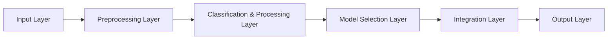
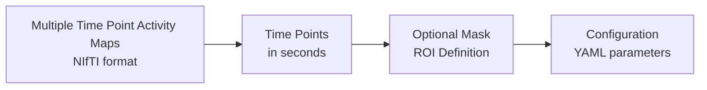
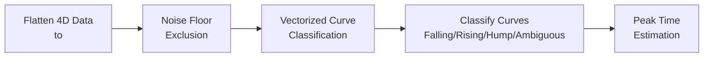
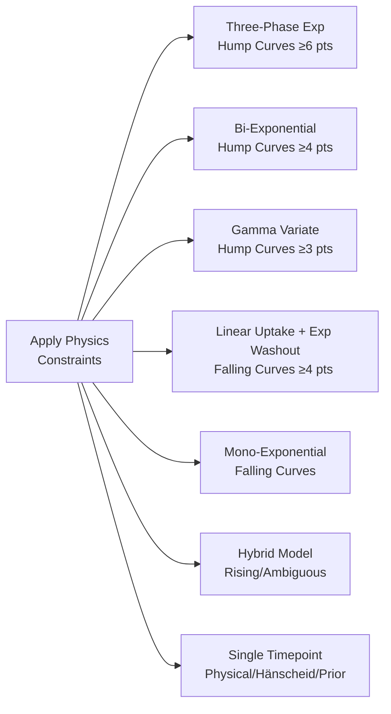
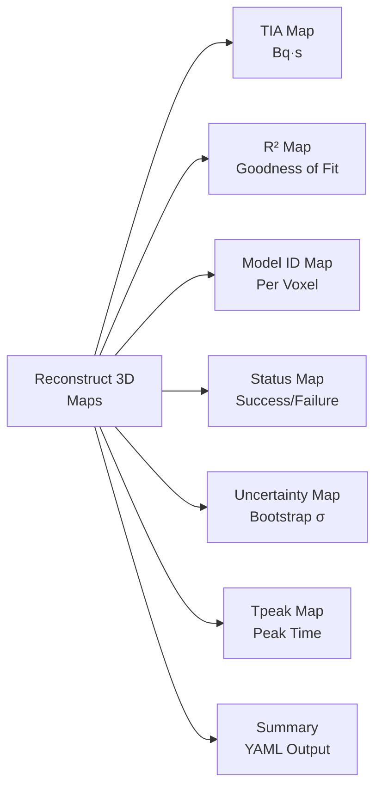

# PyTIA Architecture: Multiple Time Point Activity Data Processing for TIA Calculation

## Overview

PyTIA (Python Time-Integrated Activity) is a robust computational framework designed to calculate Time-Integrated Activity (TIA) from multiple time point activity maps obtained from PET/SPECT imaging. The architecture is optimized for handling dynamic imaging data with various curve types and noise characteristics.

## High-Level Architecture Overview



## Detailed Layer Diagrams

### Input Layer



### Preprocessing Layer


### Classification & Processing Layer



### Model Selection Layer



### Integration Layer


### Output Layer



## Detailed Architecture Components

### 1. Input Layer
The input layer handles the ingestion of multiple time point activity maps:
- **Activity Maps**: 3D images at different time points in NIfTI format
- **Time Points**: Acquisition times in seconds (configurable units: seconds/hours)
- **Optional Mask**: Region of interest definition to limit processing to specific areas
- **Configuration**: YAML-based parameters for all processing steps

### 2. Preprocessing Layer
The preprocessing layer ensures data quality and prepares the data for analysis:
- **Image Loading**: Uses nibabel to load NIfTI files while preserving spatial information
- **Time Sorting**: Sorts time points chronologically if configured
- **Negative Clamp**: Sets negative activity values to zero to ensure physical validity
- **Mask Generation**: Creates masks using Otsu thresholding, provided mask, or body mask
- **Denoising**: Applies masked Gaussian smoothing to reduce noise while preserving edges
- **Voxel Volume Calculation**: Computes voxel volume in mL for proper unit handling
- **Convert to Bq per Voxel**: Scales from Bq/mL to Bq per voxel using volume

### 3. Classification & Processing Layer
The classification layer identifies the type of time-activity curve for each voxel:
- **Data Flattening**: Converts 4D data (x, y, z, time) to 2D matrix (voxels, time)
- **Noise Floor Exclusion**: Identifies and excludes time points below noise threshold per voxel
- **Vectorized Classification**: Processes all voxels simultaneously using numpy operations
- **Curve Types**: Classifies curves into four categories using [classify_curves](file:///mnt/d/WSL/workspace/devhliu/Dosimetry/PyTIA/PyTIA/src/pytia/classify.py#L12-L46):
  - **Falling**: Peak at first valid timepoint, typical of rapid clearance organs (kidneys), class ID 1
  - **Rising**: Peak at last valid timepoint, typical of sustained uptake (tumors), class ID 2
  - **Hump**: Peak between first and last timepoints, typical of uptake and clearance (liver), class ID 3
  - **Ambiguous**: Insufficient or noisy data for clear classification, class ID 4
- **Peak Time Estimation**: Computes peak time using different methods based on curve type

### 4. Model Selection Layer
The model selection layer applies appropriate kinetic models based on curve classification and available data points:
- **Physics Constraints**: Ensures clearance rates satisfy λ ≥ λ_phys (physical decay) when enabled
- **Voxel Mode**: Each voxel processed independently with optimal model
- **Region Mode**: ROI-based processing with aggregate activity curves
- **Three-Phase Exponential Model**: For hump curves with ≥6 time points, fits complex uptake/washout kinetics (Model ID: 60) in [three_phase.py](file:///mnt/d/WSL/workspace/devhliu/Dosimetry/PyTIA/PyTIA/src/pytia/models/three_phase.py)
- **Bi-Exponential Model**: For hump curves with ≥4 time points, fits dual exponential kinetics (Model ID: 40) in [biexp.py](file:///mnt/d/WSL/workspace/devhliu/Dosimetry/PyTIA/PyTIA/src/pytia/models/biexp.py)
- **Gamma Variate Model**: For hump curves with ≥3 time points and t > 0, uses A(t) = K * t^α * exp(-βt), linearized as ln(A) = ln(K) + α*ln(t) - β*t, solved with weighted least squares (WLS) normal equations, with analytical integration using gamma function (Model ID: 30) in [gamma_linear.py](file:///mnt/d/WSL/workspace/devhliu/Dosimetry/PyTIA/PyTIA/src/pytia/models/gamma_linear.py)
- **Linear Uptake + Exponential Washout Model**: For falling curves with ≥4 time points, fits linear uptake phase followed by exponential washout (Model ID: 50) in [uptake_washout.py](file:///mnt/d/WSL/workspace/devhliu/Dosimetry/PyTIA/PyTIA/src/pytia/models/uptake_washout.py)
- **Mono-Exponential Model**: For falling curves, fits exponential tail A(t) = A_peak * exp(-λ_eff * (t - t_peak)) using log-linear regression after peak time with triangle uptake approximation (0.5 * A_peak * t_peak) (Model ID: 20) in [monoexp.py](file:///mnt/d/WSL/workspace/devhliu/Dosimetry/PyTIA/PyTIA/src/pytia/models/monoexp.py)
- **Hybrid Model**: For rising/ambiguous curves, uses trapezoidal integration of observed points + physical tail extrapolation A_last / λ_phys (Model ID: 10 for rising, 11 for ambiguous) in [hybrid.py](file:///mnt/d/WSL/workspace/devhliu/Dosimetry/PyTIA/PyTIA/src/pytia/models/hybrid.py)
- **Single Timepoint Models**: For single timepoint data, computes TIA = A(t) / λ_eff using one of three methods (Model IDs: 101=Physical, 102=Hänscheid, 103=Prior half-life)
- **Adaptive Model Selection**: Selects most complex appropriate model based on data points available (≥6: 3-phase, ≥4: biexp/uptake-washout, ≥3: gamma, ≥2: monoexp/hybrid)
- **Fitting Functions**: Implemented in separate modules with vectorized operations

### 5. Integration Layer
The integration layer computes the final TIA values:
- **Curve Integration**: Calculates area under the time-activity curve using appropriate method (analytical for gamma/biexp/3-phase, numerical for uptake-washout with triangle approximation, trapezoidal for hybrid)
- **Tail Extrapolation**: Extrapolates to infinity using physical decay constant A_last / λ_phys, fitted exponential tail, or hybrid approach
- **Bootstrap Uncertainty**: Optional resampling for confidence intervals using residual bootstrap (if enabled)
- **Chunked Processing**: Processes large volumes in chunks for memory efficiency
- **Goodness of Fit**: Computes R² values to assess model fit quality
- **Status Tracking**: Monitors fitting success/failure per voxel with detailed status codes

### 6. Output Layer
The output layer generates comprehensive results:
- **TIA Map**: Primary output with TIA values in Bq·s
- **R² Map**: Goodness-of-fit measure for each voxel
- **Model ID Map**: Indicates which model was used per voxel (10/11=Hybrid, 20=Mono-exp, 30=Gamma, 40=Bi-exp, 50=Uptake-washout, 60=Three-phase, 101-103=Single timepoint)
- **Status Map**: Success/failure codes for quality assessment (0=Outside, 1=OK, 2=Insufficient points, 3=Fit failed, 4=Below floor, 5=Nonphysical)
- **Uncertainty Map**: Bootstrap-derived uncertainty estimates (if bootstrap enabled)
- **Tpeak Map**: Peak time estimates for each voxel (if available)
- **Summary File**: YAML output with configuration, timing, and status information

## Robustness Features

### Noise Handling
- Spatial denoising using masked Gaussian filtering
- Negative activity clamping to zero
- Per-voxel noise floor exclusion with configurable thresholds
- Robust peak estimation using all available data points
- Relative and absolute noise floor modes

### Physics Integration
- Physical decay constraints (λ ≥ λ_phys) for realistic clearance rates when enabled
- Tail extrapolation with multiple modes: physical (A_last / λ_phys), fitted exponential, or hybrid approach
- Configurable radionuclide half-life
- Physics validation to ensure proper modeling
- Support for physical decay constant enforcement via configuration

### Model Selection
- Automatic classification per voxel based on curve characteristics using vectorized operations
- Multiple model options with adaptive selection based on available data points
- Physics-constrained parameter estimation with configurable enforcement
- Validation checks for model applicability and parameter validity
- Support for both voxel-wise and region-based processing
- Fallback strategies when complex models fail (e.g., gamma fails → hybrid when t≤0)
- Adaptive complexity: ≥6 points → 3-phase, ≥4 points → biexp/uptake-washout, ≥3 points → gamma, ≥2 points → monoexp/hybrid
- Gamma model requires t > 0 for implementation

### Performance Optimization
- Vectorized operations to avoid slow voxel loops
- Chunked processing for memory efficiency with configurable chunk size
- Matrix-based computations for speed
- Configurable chunk size for optimization
- Optional profiling and performance timing
- Efficient batch processing of multiple voxels

## Usage Modes

### Multi-Timepoint Mode
- Processes 2+ time points with dynamic activity changes
- Applies comprehensive kinetic modeling with curve classification
- Supports both voxel and region-based analysis
- Provides comprehensive uncertainty quantification via bootstrap
- Outputs TIA, R², model ID, status ID, uncertainty, and Tpeak maps
- Includes 6 different kinetic models based on curve type and data availability
- Supports chunked processing for memory efficiency
- Implements physics constraints and tail extrapolation options

### Single-Timepoint Mode
- Estimates TIA from single time point using prior knowledge
- Supports three methods: physical decay, Hänscheid, and prior half-life
- Supports both global and segmentation-based priors
- Useful when dynamic imaging is not available
- Model IDs: 101=Physical, 102=Hänscheid, 103=Prior half-life
- Physical decay: Uses radionuclide half-life for effective decay constant
- Hänscheid method: Uses effective half-life in human body (falls back to physical half-life if not provided)
- Prior half-life: Supports label-map based half-lives with global fallback
- Enables single-image dosimetry with appropriate prior knowledge

### Processing Modes
- **Voxel Mode**: Each voxel processed independently with optimal model based on curve type and data points
- **Region Mode**: ROI-based processing with aggregate activity curves and scaling
- **Chunked Processing**: Large volumes processed in configurable chunks for memory efficiency
- **Bootstrap Replicates**: Optional uncertainty quantification via residual bootstrap with configurable number of replicates

## Mathematical Formulation for Vectorized Model Fitting

### Vectorized Implementation Approach

The vectorized model fitting is implemented using batch matrix operations to simultaneously process multiple voxels:

- **Batch Processing**: All N voxels are processed simultaneously using (N, T) shaped arrays
- **Masked Operations**: Invalid time points are handled with boolean masks (N, T) arrays
- **Matrix Equations**: Normal equations are solved in batch using numpy operations
- **Broadcasting**: Parameters and calculations are broadcast across all voxels efficiently

### Mono-Exponential Model

For falling curves, the mono-exponential model is fitted using log-linear regression:

```
A(t) = A_peak * exp(-λ_eff * (t - t_peak))

Linearized: ln(A) = ln(A_peak) - λ_eff * (t - t_peak)

Fitted using weighted least squares on tail points after peak time

TIA = 0.5 * A_peak * t_peak + A_peak / λ_eff
```

**Vectorized Implementation:**

- Input: A (N, T) activity array, valid (N, T) boolean mask, peak_index (N,) array
- Tail mask computed as: `tail_mask = valid & (j >= peak_index[:, None]) & (A > 0)` where j is time index array
- Weighted sums computed in batch: Sw, Sx, Sy, Sxx, Sxy using masked operations
- Slope computed in batch: `slope = (Sw * Sxy - Sx * Sy) / (Sw * Sxx - Sx^2)`
- Decay constant: `lam = -slope` with physics constraint applied element-wise
- TIA computed in batch: `tia = 0.5 * Apeak * tpeak + (Apeak / lambda_eff)`

### Gamma Variate Model

For hump curves with t > 0, the gamma variate model uses:

```
A(t) = K * t^α * exp(-βt)

Linearized: ln(A) = ln(K) + α*ln(t) - β*t

Solved using weighted least squares (WLS) normal equations

TIA = K * Γ(α + 1) / β^(α + 1) where Γ is the gamma function
```

**Vectorized Implementation:**

- Input: A (N, T) activity array, valid (N, T) boolean mask
- Precomputed design matrix components: x0 = 1, x1 = ln(t), x2 = -t
- Weighted sums computed in batch: Sw, Sx1, Sx2, Sx1x1, Sx1x2, Sx2x2, Sy, Sx1y, Sx2y
- Normal equations assembled as: G (N, 3, 3) matrix and b (N, 3) vector
- Batch solving: `params = np.linalg.solve(G[i], b[i])` for each valid voxel i
- Parameters constrained element-wise: `beta = max(beta, lambda_phys)`
- TIA computed in batch: `tia = K * gamma_func(alpha + 1.0) / (beta ** (alpha + 1.0))`

### Bi-Exponential Model

For hump curves with ≥4 time points, the bi-exponential model:

```
A(t) = C * (exp(-λ1 * t) - exp(-λ2 * t))

Fitted using nonlinear least squares with Levenberg-Marquardt

TIA = C * (1/λ1 - 1/λ2)
```

**Vectorized Implementation:**

- Input: A (N, T) activity array, valid (N, T) boolean mask, peak_index (N,) array
- Per-voxel fitting: Loop through each voxel i with sufficient valid points (≥5)
- Initial parameters estimated per voxel: C_init, λ1_init, λ2_init
- Batch nonlinear fitting: scipy.optimize.curve_fit applied per voxel
- Physics constraints applied per voxel: `λ1 = max(λ1, λ_phys)`, `λ2 = max(λ2, λ_phys)`
- TIA computed in batch: `tia = C * (1/λ1 - 1/λ2)` where valid

### Three-Phase Exponential Model

For hump curves with ≥6 time points, the three-phase model:

```
A(t) = C * (1 - exp(-λ_uptake * t)) * (f_fast * exp(-λ_fast * t) + (1 - f_fast) * exp(-λ_slow * t))

Fitted using nonlinear least squares with Levenberg-Marquardt

TIA = C * [1/λ_uptake - f_fast/(λ_uptake + λ_fast) - (1 - f_fast)/(λ_uptake + λ_slow)]
```

**Vectorized Implementation:**

- Input: A (N, T) activity array, valid (N, T) boolean mask, peak_index (N,) array
- Per-voxel fitting: Loop through each voxel i with sufficient valid points (≥6)
- Initial parameters estimated per voxel: C_init, λ_uptake_init, λ_fast_init, λ_slow_init, f_fast_init
- Batch nonlinear fitting: scipy.optimize.curve_fit applied per voxel
- Physics constraints applied per voxel: `λ_fast = max(λ_fast, λ_phys)`, `λ_slow = max(λ_slow, λ_phys)`
- TIA computed in batch: `tia = C * (1/λ_uptake - f_fast/(λ_uptake + λ_fast) - (1 - f_fast)/(λ_uptake + λ_slow))` where valid

### Linear Uptake + Exponential Washout Model

For falling curves with ≥4 time points:

```
For t ≤ t_max: A(t) = (A_max / t_max) * t
For t > t_max: A(t) = A_max * exp(-λ * (t - t_max))

Washout phase fitted using log-linear regression: ln(A) = ln(A_max) - λ * (t - t_max)

TIA = 0.5 * A_max * t_max + A_max / λ
```

**Vectorized Implementation:**

- Input: A (N, T) activity array, valid (N, T) boolean mask, peak_index (N,) array
- Peak values extracted: `A_max = A[i, peak_index[i]]` using advanced indexing
- Tail mask computed: `tail_mask = (t > t_max[:, None]) & valid2 & (A > 0)`
- Weighted least squares applied per voxel: `poly = np.polyfit(t_tail, log_A_tail, 1)`
- Decay constant: `λ = -poly[0]` with physics constraint applied element-wise
- TIA computed in batch: `tia = 0.5 * A_max * t_max + A_max / λ`

### Hybrid Model

For rising/ambiguous curves:

```
TIA = Observed area (trapezoidal integration) + Tail extrapolation

For physical tail: TIA_tail = A_last / λ_phys
For fitted tail: TIA_tail = A_last / λ_fitted
```

**Vectorized Implementation:**

- Input: A (N, T) activity array, valid (N, T) boolean mask, lambda_phys scalar
- Trapezoidal integration computed in batch: `area_obs = np.nansum(0.5 * (a0 + a1) * dt, axis=1)`
- Last valid time point identified: `last_valid = T - 1 - np.argmax(valid[:, ::-1], axis=1)`
- Last valid activity values: `Alast = A[i, last_valid[i]]` using advanced indexing
- Tail computation: `tail = Alast / lambda_phys` for physical mode
- For fitted tail: log-linear regression applied per voxel: `poly, cov = np.polyfit(t_tail, log_A_tail, 1, cov=True)`
- Final TIA: `tia = area_obs + tail`

### Single Timepoint Models

For single timepoint data:

```
TIA = A(t) / λ_eff

Where λ_eff is determined by method:
- Physical: λ_eff = ln(2) / T_half
- Hänscheid: λ_eff = ln(2) / T_eff
- Prior: λ_eff = ln(2) / T_prior
```

**Vectorized Implementation:**

- Input: A (N,) activity array for masked voxels, method specification
- Physics-based λ_eff computed: `λ_phys = ln(2) / T_half` as scalar
- For Hänscheid method: `λ_eff = ln(2) / T_eff` with fallback to λ_phys
- For prior method: per-voxel λ_eff computed from label mapping
- TIA computed in batch: `tia = A / λ_eff` where activity is valid and λ_eff is positive
- Per-voxel processing for label-based priors: `λ_eff[i] = ln(2) / T_half_label[labs[i]]`

### Physics Constraints

When enabled, decay constants are constrained as:

```
λ ≥ λ_phys = ln(2) / T_half
```

**Vectorized Implementation:**

- Physics decay constant: `λ_phys = ln(2) / T_half` computed once as scalar
- Element-wise constraint: `λ = max(λ, λ_phys)` applied to valid parameter arrays
- Boolean masking: `λ = np.where(np.isfinite(λ), np.maximum(λ, λ_phys), λ)`
- Applied during parameter estimation for each model fitting process

## Automatic Classification and Model Selection

### Curve Classification Algorithm

The automatic classification identifies curve types based on activity patterns:

```
Falling: peak at first valid timepoint AND (n_neg > 0)
Rising: peak at last valid timepoint AND (n_pos > 0)
Hump: peak between first and last timepoints (first_valid < peak_index < last_valid)
Ambiguous: insufficient or noisy data for clear classification
```

**Classification Implementation:**

- Input: A (N, T) activity array, valid (N, T) boolean mask, eps_rel (relative threshold)
- Peak index: `idx_max = np.argmax(A_for_peak, axis=1)` where `A_for_peak = np.where(valid, A, -np.inf)`
- First/last valid indices: `first_valid = np.argmax(valid, axis=1)`, `last_valid = T - 1 - np.argmax(valid[:, ::-1], axis=1)`
- Gradient analysis: `dA = np.diff(A, axis=1)`, `dv = valid[:, 1:] & valid[:, :-1]`
- Relative threshold: `eps = max(A_max * eps_rel, 1e-6)` where `A_max = np.nanmax(A, axis=1)`
- Sign counts: `n_pos = sum((dA > eps[:, None]) & dv)`, `n_neg = sum((dA < -eps[:, None]) & dv)`
- Classification: `falling = (idx_max == first_valid) & (n_neg > 0)`, `rising = (idx_max == last_valid) & (n_pos > 0)`, `hump = (idx_max > first_valid) & (idx_max < last_valid)`

### Model Selection Algorithm

The model selection algorithm chooses the most appropriate model based on curve type and available data points:

```
For hump curves:
  - If n_valid >= 6: Three-Phase Exponential (ID: 60)
  - Else if n_valid >= 4: Bi-Exponential (ID: 40)
  - Else if n_valid >= 3 AND t > 0: Gamma Variate (ID: 30)
  - Else: Hybrid (ID: 11)

For falling curves:
  - If n_valid >= 4: Linear Uptake + Exp Washout (ID: 50)
  - Else: Mono-Exponential (ID: 20)

For rising/ambiguous curves:
  - Hybrid Model (ID: 10 for rising, ID: 11 for ambiguous)

For single timepoint:
  - Physical decay (ID: 101), Hänscheid (ID: 102), or Prior half-life (ID: 103)
```

**Model Selection Implementation:**

- Input: classification results (N,) array, n_valid (N,) array, time array with validation
- Hump model selection: `hump_3phase = hump & (n_valid >= 6)`, `hump_biexp = hump & (n_valid >= 4) & (~hump_3phase)`, etc.
- Falling model selection: `falling_uw = falling & (n_valid >= 4)`, `falling_mono = falling & (~falling_uw)`
- Fallback handling: If gamma model fails due to t <= 0, automatically use hybrid model
- Physics constraints applied to all fitted parameters
- Status tracking: Each voxel assigned status code based on fitting success/failure

This architecture ensures robust, efficient, and accurate TIA calculation suitable for both research and clinical applications in nuclear medicine dosimetry.